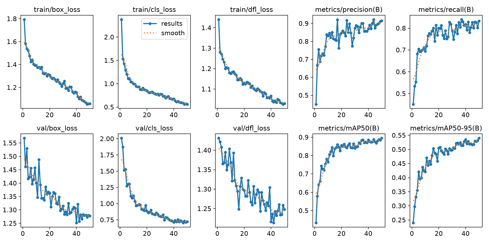

# Module 2 Results

## Project
**Face Mask Detection using YOLOv8n**

---

# Dataset Information

- **Dataset:** Face Mask Detection Dataset (YOLO Format)
- **Number of Classes:** 2
  - mask
  - no_mask
- **Total Images:** 692
- **Training Images:** 553
- **Validation Images:** 69
- **Test Images:** 70

---

# Model Configuration

| Parameter | Value |
|-----------|-------|
| Model | YOLOv8n |
| Image Size | 640 × 640 |
| Epochs | 50 |
| Batch Size | 4 |
| Device | CPU |
| Random Seed | 42 |

---

# Validation Results

| Metric | Value |
|--------|------:|
| Precision | **91.18%** |
| Recall | **82.98%** |
| mAP@0.5 | **89.54%** |
| mAP@0.5:0.95 | **53.65%** |

---

# Test Results

| Metric | Value |
|--------|------:|
| Precision | **86.55%** |
| Recall | **84.29%** |
| mAP@0.5 | **88.23%** |
| mAP@0.5:0.95 | **53.67%** |

---

# Inference Performance

Inference was measured on the test dataset after warming up the model.

| Metric | Value |
|--------|------:|
| Images Tested | 100 |
| Total Time | 11.43 s |
| Average Latency | 114.27 ms/image |
| FPS | 8.75 |

---

# Failure Analysis

The following failure cases were observed while evaluating the model on the test dataset:

### 1. Duplicate Detections
In some images, the model detected the same person twice by placing one bounding box around the face and another around the cap.

### 2. False Positives on Hand Gestures
The model occasionally detected a thumbs-up gesture as a face and classified it as **no_mask**.

### 3. Incorrect Detection of Handheld Objects
Objects held in a person's hand were sometimes classified as **mask** or **no_mask**, even though they were not faces.

### 4. Incorrect Classification of Improperly Worn Masks
When a mask was worn below the nose or around the chin, the model often classified the person as wearing a mask instead of identifying it as an incorrect usage.

---

# Possible Reasons

- Limited diversity in the training dataset.
- Insufficient examples of challenging backgrounds and distracting objects.
- No separate class for improperly worn masks.
- Small YOLOv8n model may have limited capacity compared to larger variants.

---

# Suggested Improvements

- Increase the size and diversity of the dataset.
- Include more images containing hats, hands, and other distracting objects.
- Introduce an additional **improper_mask** class.
- Train using a larger model (YOLOv8s or YOLOv8m) if GPU resources are available.
- Apply additional data augmentation techniques to improve robustness.

---

# Conclusion

A YOLOv8n object detection model was successfully trained for face mask detection using a custom dataset in YOLO format. The model achieved strong performance, with a validation mAP@0.5 of **89.54%** and a test mAP@0.5 of **88.23%**. Inference benchmarking showed an average latency of **114.27 ms per image** (approximately **8.75 FPS**) on a CPU.

Although the model performed well overall, failure analysis revealed challenges with duplicate detections, false positives caused by hand gestures and handheld objects, and incorrect classification of improperly worn masks. These observations provide clear directions for future improvements through better data collection, annotation, and model scaling.

# Training Curves

